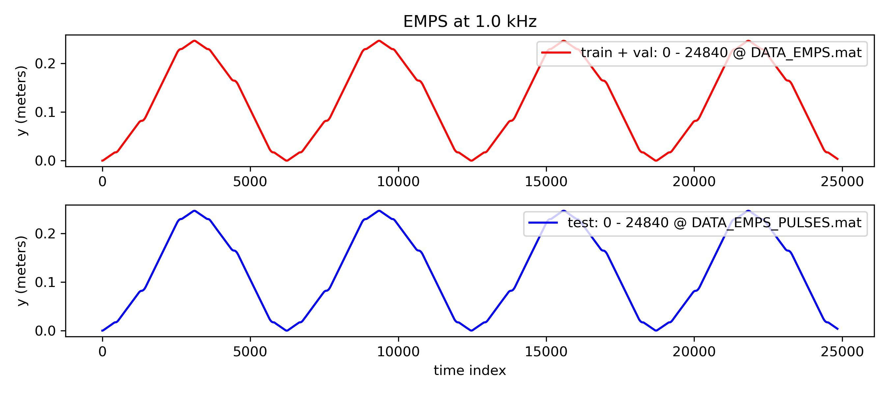

# nonlinear_benchmarks
 
The official dataloader of [nonlinearbenchmark.org](http://www.nonlinearbenchmark.org/). This toolbox can automatically download, load and split many of the datasets which can be found on the website. 

For intance, https://www.nonlinearbenchmark.org/benchmarks/wiener-hammerstein.

```python
import nonlinear_benchmarks
train_val, test = nonlinear_benchmarks.WienerHammerBenchMark()
sampling_time = train_val.sampling_time #in seconds
u_train, y_train = train_val #or train_val.u, train_val.y
u_test, y_test = test        #or test.u,      test.y
```

In the `WienerHammerBenchMark` multiple options are provided. You can find the data files by using `raw_data=True` and obtain the entire, not train-test splitted, dataset by using `train_test_split=False`.

# Install

```
pip install nonlinear-benchmarks
```

# Datasets

Multiple datasets have been implemented with an official train test split which are given below. (p.s. datasets without a official train test split can be found in `nonlinear_benchmarks.not_splitted_benchmarks`)

## EMPS



```python
train_val, test = nonlinear_benchmarks.EMPS()
train_val_u, train_val_y = train_val
test_u, test_y = test
```

## CED


```python
train_val, test = nonlinear_benchmarks.CED()
(train_val_u_1, train_val_y_1), (train_val_u_2, train_val_y_2) = train_val
(test_u_1, test_y_1), (test_u_2, test_y_2) = test
```

## Cascaded_Tanks


```python
train_val, test = nonlinear_benchmarks.Cascaded_Tanks()
train_val_u, train_val_y = train_val
test_u, test_y = test
```


## WienerHammerBenchMark


```python
train_val, test = nonlinear_benchmarks.WienerHammerBenchMark()
train_val_u, train_val_y = train_val
test_u, test_y = test
```


## Silverbox


```python
train_val, test = nonlinear_benchmarks.Silverbox()
multisine_train_val = train_val
test_multisine, test_arrow_full, test_arrow_no_extrapolation = test
```

Note that the test arrow full and the test arrow no extrapolation have some overlap.