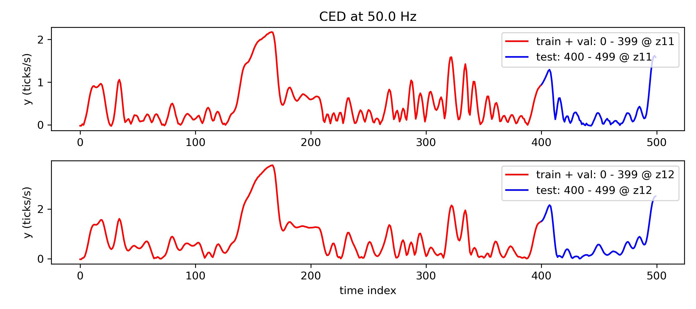

# nonlinear_benchmarks
 
The official dataloader of [nonlinearbenchmark.org](http://www.nonlinearbenchmark.org/). This toolbox simplifies the process of downloading, loading, and splitting various datasets available on the website. It also some basics instruction on submitting benchmark results and commonly used error metrics.

## Usage Example

https://www.nonlinearbenchmark.org/benchmarks/wiener-hammerstein is loaded as:

```python
import nonlinear_benchmarks
train_val, test = nonlinear_benchmarks.WienerHammerBenchMark()

print(train_val) 
# prints : Input_output_data "train WH" u.shape=(100000,) y.shape=(100000,)
#          sampling_time=1.953e-05
print(test)
# prints: Input_output_data "test WH" u.shape=(78800,) y.shape=(78800,) 
#         sampling_time=1.953e-05 state_initialization_window_length=50

sampling_time = train_val.sampling_time # in seconds
u_train, y_train = train_val            # to unpack or use train_val.u, train_val.y
u_test, y_test   = test                 # to unpack or use test.u,      test.y
print(test.state_initialization_window_length) 
#state_initialization_window_length = The number of samples that can be used at the 
#                                     start of the test set to initialize the model state.

print(train_val[:100])                  # creates a slice of the train_val data from 0 to 100
```

## Useful Options

When using the `WienerHammerBenchMark` (or any other benchmark function), you can customize the behavior with the following options:

 * `data_file_locations=True` : Returns the raw data file locations.
 * `train_test_split=False` : Retrieves the entire dataset without splitting.
 * `force_download=True` : Forces (re-)downloading of benchmark files.
 * `url=` : Allows manual override of the download link (contact maintainers if the default link is broken).
 * `atleast_2d=True`: Converts input/output arrays to at least 2D shape (e.g. `u.shape = (250,)` becomes `u.shape = (250, 1)`).
 * `always_return_tuples_of_datasets=True`: Even if there is only a single training or test set a list is still returned (i.e. adds `[train] if not isinstance(train,list) else train`)

# Install

```
pip install nonlinear-benchmarks
```

# Datasets

Multiple datasets have been implemented with an official train test split which are given below. 

(p.s. datasets without an official train test split can be found in `nonlinear_benchmarks.not_splitted_benchmarks`)

## [Electro-Mechanical Positioning System (EMPS)](https://www.nonlinearbenchmark.org/benchmarks/emps)


```python
train_val, test = nonlinear_benchmarks.EMPS()
print(test.state_initialization_window_length) # = 20
train_val_u, train_val_y = train_val
test_u, test_y = test
```

Benchmark Results Submission template: [submission_examples/EMPS.py](submission_examples/EMPS.py)


## [Coupled Electric Drives (CED)](https://www.nonlinearbenchmark.org/benchmarks/coupled-electric-drives)



```python
train_val, test = nonlinear_benchmarks.CED()
print(test[0].state_initialization_window_length) # = 4
(train_val_u_1, train_val_y_1), (train_val_u_2, train_val_y_2) = train_val
(test_u_1, test_y_1), (test_u_2, test_y_2) = test
```

This dataset consists of two time series where the first has a low input amplitude (`train_val_1` and `test_1`) and the second a high input amplitude (`train_val_2` and `test_2`).  

You can use both training sets in your training, and please report the RMSE values on both test sets separately. 

Benchmark Results Submission template: [submission_examples/CED.py](submission_examples/CED.py)


## [Cascaded Tanks with Overflow (Cascaded_Tanks)](https://www.nonlinearbenchmark.org/benchmarks/cascaded-tanks)


```python
train_val, test = nonlinear_benchmarks.Cascaded_Tanks()
print(test.state_initialization_window_length) # = 4
train_val_u, train_val_y = train_val
test_u, test_y = test
```

Benchmark Results Submission template: [submission_examples/Cascaded_Tanks.py](submission_examples/Cascaded_Tanks.py)

## [Wiener-Hammerstein System (WienerHammerBenchMark)](https://www.nonlinearbenchmark.org/benchmarks/wiener-hammerstein)


```python
train_val, test = nonlinear_benchmarks.WienerHammerBenchMark()
print(test.state_initialization_window_length) # = 50
train_val_u, train_val_y = train_val
test_u, test_y = test
```

Benchmark Results Submission template: [submission_examples/WienerHammerBenchMark.py](submission_examples/WienerHammerBenchMark.py)


## [Silverbox](https://www.nonlinearbenchmark.org/benchmarks/silverbox)


```python
train_val, test = nonlinear_benchmarks.Silverbox()
multisine_train_val = train_val
print(test[0].state_initialization_window_length) # = 50 (for all test sets)
test_multisine, test_arrow_full, test_arrow_no_extrapolation = test
```

Benchmark Results Submission template: [submission_examples/silverbox.py](submission_examples/silverbox.py)

Note that the `test_arrow_no_extrapolation` is a subset of the `test_arrow_full`.

# Error Metrics

We also provide error metrics in `nonlinear_benchmarks.error_metrics`.

```python
from nonlinear_benchmarks.error_metrics import RMSE, NRMSE, R_squared, MAE, fit_index

#generate example ouput data and prediction 
y_true = np.random.randn(100)
y_model = y_true + np.random.randn(100)/100

print(f"RMSE: {RMSE(y_true, y_model)} (Root Mean Square Error)")
print(f"NRMSE: {NRMSE(y_true, y_model)} (Normalized Root Mean Square Error)")
print(f"R-squared: {R_squared(y_true, y_model)} (coefficient of determination R^2)")
print(f'MAE: {MAE(y_true, y_model)} (Mean Absolute value Error)')
print(f"fit index: {fit_index(y_true, y_model)} (https://arxiv.org/pdf/1902.00683.pdf page 31)")
```

# Benchmark Result Submission

In the reporting of the benchmark result please use it as follows;

```python
train_val, test = nonlinear_benchmarks.WienerHammerBenchMark()
n = test.state_initialization_window_length

# y_model = your model output using only test.u and test.y[:n]

RMSE_result = RMSE(test.y[n:], y_model[n:]) #skip the first n
print(RMSE_result) #report this number
```

For example see the Silverbox submission template: [submission_examples/silverbox.py](submission_examples/silverbox.py)

